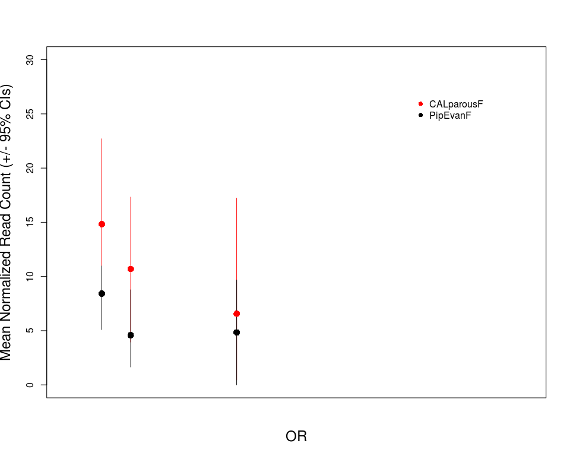
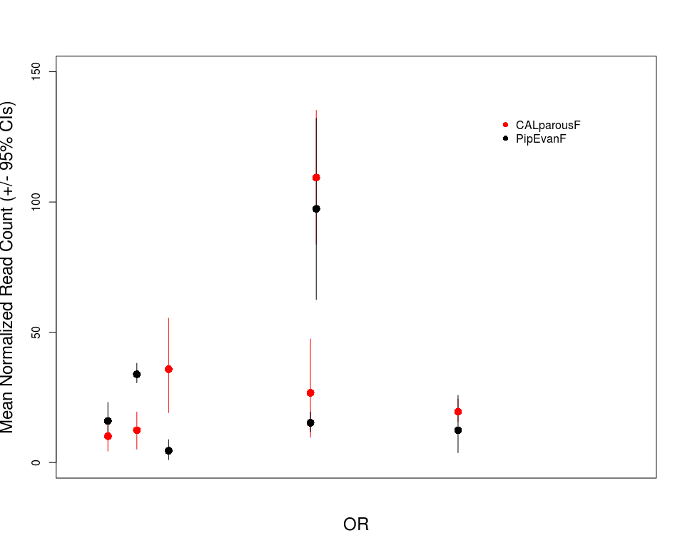
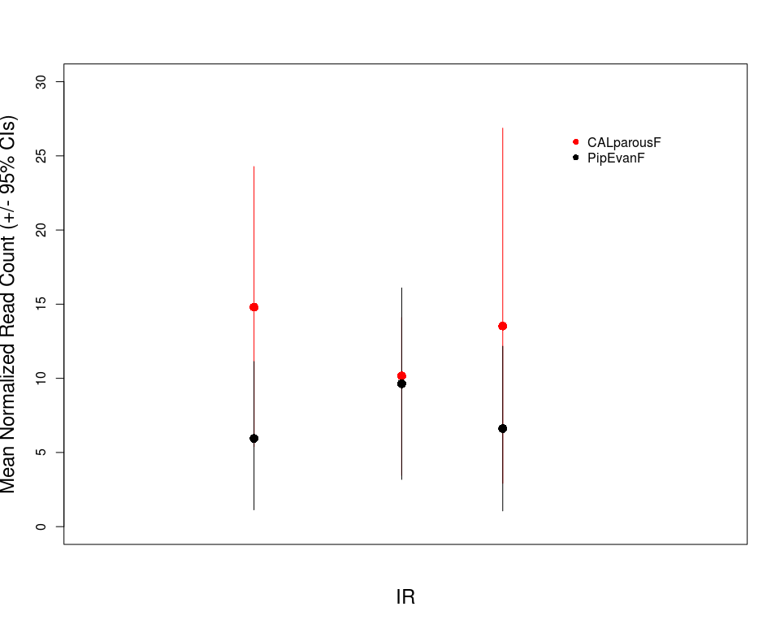
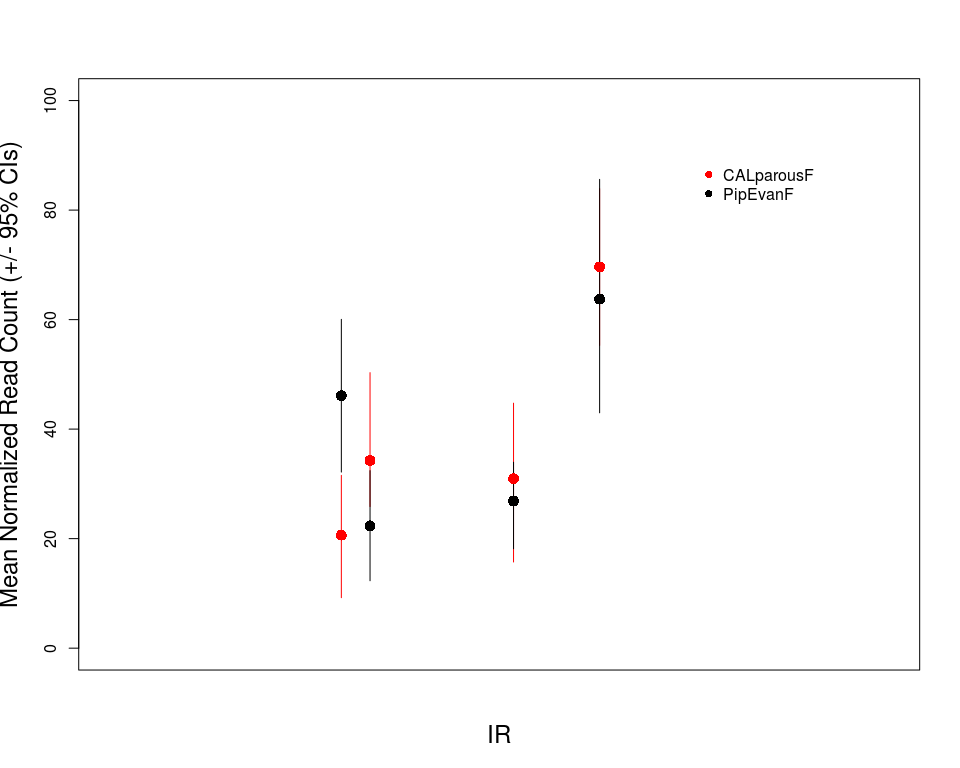
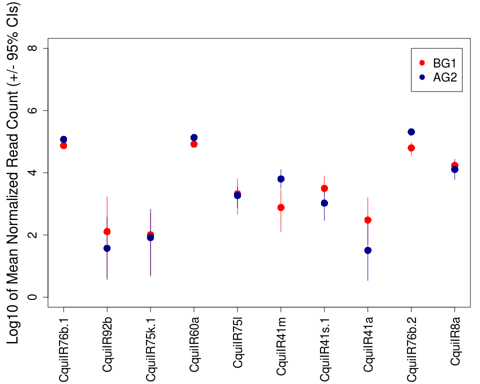

Culex\_Chemosensory\_EDA\_03052018
================
Megan Fritz
written March 5, 2018; updated Dec. 10, 2020

#### Background

##### The goal of this work was to examine the divergence in levels of chemosensory gene expression in the heads of above- and below-ground Culex pipiens mosquitoes. These mosquitoes tend to have differing host preferences (see Fritz et. al 2015), where above-ground mosquitoes are more aviphilic and below-ground mosquitoes tend toward mammalophilicity. My primary question was which OBPs, ORs, and IRs, if any, show differences in expression levels and may be involved in host preference.

#### Analytical Methods

##### This is my bootstrapping function to generate my 95% confidence intervals for my figures.

``` r
boot.fn <- function(x, N=5000) {
  Int.1 <- replicate(N, mean(sample(x, size= length(x), replace=T)))
  Int.CI <- quantile(Int.1, probs=c(0.025,0.975))
  Int.CI
}
```

##### Loading in data sets and libraries.

``` r
library(sciplot)

#use this to specify the file paths
genes_detected <- read.table("~/Desktop/CulexRNAseq/data/CALparousF_v_PipEvanF_AllGenes_LFCS.txt", header = F)#using LCFS for the parous v pip contrast
genes_detected$abbrev_VB_ID <- gsub("-RA", "", genes_detected$V1) #removing mods to VB ID

gff3 <- read.table("~/Desktop/CulexRNAseq/data/Culex-quinquefasciatus-Johannesburg_BASEFEATURES_CpipJ2.4.gff3", sep="\t", stringsAsFactors=F)

genes_only <-subset(gff3, V3 =="gene")

norm_read_counts <- read.table("~/Desktop/CulexRNAseq/data/Normalized_ReadCounts_CalParVPip.txt", header = T)#note this is for parousvpip; added later because most of the gravid v parous contrasts are not interesting for this part.

ids <- sapply(strsplit(genes_only$V9,";"),.subset,1)
ID <- sapply(strsplit(ids, "="),.subset,2)
gene_name <- sapply(strsplit(genes_only$V9,";"),.subset,2)
gene_name2 <- sapply(strsplit(gene_name, "="),.subset,2)
gene_desc <- sapply(strsplit(genes_only$V9,";"),.subset,3)
gene_desc2 <- sapply(strsplit(gene_desc, "="),.subset,2)
ids3 <- data.frame(cbind(ID,gene_name2,gene_desc2))

#adding all gene descriptions to genes detected
merged_Fritz_detected <- merge(genes_detected, ids3, by.x = "abbrev_VB_ID", by.y = "ID")

#adding readcounts to merged dataset
merged_Fritz_withCounts <- merge(merged_Fritz_detected, norm_read_counts, by.x = "abbrev_VB_ID", by.y = "Name")


OBPs <- read.csv("~/Desktop/CulexRNAseq/data/Culex_OBPs_2013.csv", header = T) #seem to be missing one OBP here.
ORs <- read.csv("~/Desktop/CulexRNAseq/data/QuinqORs.csv", header = T)
IRs <- read.csv("~/Desktop/CulexRNAseq/data/QuinqIRs.csv", header = T)
GRs <- read.csv("~/Desktop/CulexRNAseq/data/GR_download_20190311121015.csv", header = T)#downloaded from VB on 3/11/2019
CSPs <- read.csv("~/Desktop/CulexRNAseq/data/Culex_CSPs_2013_edited.csv", header = T)
PPKs <- read.csv("~/Desktop/CulexRNAseq/data/Pickpocket_download_20190311162142.csv", header = T)

Sig_CALG_CALP <- read.table("~/Desktop/CulexRNAseq/data/CALgravidF_v_CALparousF_LFCS_padj05.txt", header = F)
Sig_CALG_CALP$abbrev_VB_ID <- gsub("-RA", "", Sig_CALG_CALP$V1) #removing mods to VB ID

Sig_CALP_Pip <- read.table("~/Desktop/CulexRNAseq/data/CALparousF_v_PipEvanF_LFCS_padj05.txt", header = F)
Sig_CALP_Pip$abbrev_VB_ID <- gsub("-RA", "", Sig_CALP_Pip$V1) #removing mods to VB ID

#now adding gene descriptions to ALL diff expressed genes for browsing
merged_CALG_CALP <- merge(Sig_CALG_CALP, ids3, by.x = "abbrev_VB_ID", by.y = "ID")
merged_CALP_Pip <- merge(Sig_CALP_Pip, ids3, by.x = "abbrev_VB_ID", by.y = "ID")

ORs$abbrev_VB_ID <- ORs$New_VB_ID 
ORs$abbrev_VB_ID <- gsub("-PA", "", ORs$abbrev_VB_ID) #removing mods to VB ID

#making SNMP dataset
accession <- c("CPIJ002160", "CPIJ014332", "CPIJ014331", "CPIJ014330")
SNMP_name <- c("SNMP2", "SNMP1c", "SNMP1b", "SNMP1a")
SNMPs <- data.frame(cbind(accession, SNMP_name))

#just pulling out relevant columns from Leal_datasets
sub_OBPs <- OBPs[,c(1:3)]
sub_ORs <- ORs[,c(1,12)]
sub_IRs <- IRs[,c(1:2)]
sub_GRs <- GRs[,c(1:2)]
sub_CSPs <- CSPs[,c(1:2)]
sub_PPKs <- PPKs[,c(1,6)]

merged_Fritz_OBP_dataset <- merge(merged_Fritz_withCounts, sub_OBPs, by.x = "abbrev_VB_ID", by.y = "VectorBase_ID")
merged_Fritz_OR_dataset <- merge(merged_Fritz_withCounts, sub_ORs, by.x = "abbrev_VB_ID", by.y = "abbrev_VB_ID")
merged_Fritz_IR_dataset <- merge(merged_Fritz_withCounts, sub_IRs, by.x = "abbrev_VB_ID", by.y = "VectorBase_ID")
merged_Fritz_GR_dataset <- merge(merged_Fritz_withCounts, sub_GRs, by.x = "abbrev_VB_ID", by.y = "accession")
merged_Fritz_SNMP_dataset <- merge(merged_Fritz_withCounts, SNMPs, by.x = "abbrev_VB_ID", by.y = "accession")
merged_Fritz_CSP_dataset <- merge(merged_Fritz_withCounts, sub_CSPs, by.x = "abbrev_VB_ID", by.y = "VectorBase.ID")
merged_Fritz_PPK_dataset <- merge(merged_Fritz_withCounts, sub_PPKs, by.x = "abbrev_VB_ID", by.y = "accession")
```

##### What numbers of genes from each of these families actually showed up as differentially expressed according to our DESeq analysis in the first place?

``` r
#OBPs for each pair-wise comparison
merged_sig_Fritz_OBP_dataset_CALGvCALP <- merge(merged_Fritz_OBP_dataset, Sig_CALG_CALP, by = "abbrev_VB_ID")
merged_sig_Fritz_OBP_dataset_CALPvPip <- merge(merged_Fritz_OBP_dataset, Sig_CALP_Pip, by = "abbrev_VB_ID")

#Printing Diff Expressed OBPs
merged_sig_Fritz_OBP_dataset_CALGvCALP$abbrev_VB_ID
nrow(merged_sig_Fritz_OBP_dataset_CALGvCALP)
merged_sig_Fritz_OBP_dataset_CALPvPip$abbrev_VB_ID
nrow(merged_sig_Fritz_OBP_dataset_CALPvPip)

#ORs for each pair-wise comparison
merged_sig_Fritz_OR_dataset_CALGvCALP <- merge(merged_Fritz_OR_dataset, Sig_CALG_CALP, by = "abbrev_VB_ID")
merged_sig_Fritz_OR_dataset_CALPvPip <- merge(merged_Fritz_OR_dataset, Sig_CALP_Pip, by = "abbrev_VB_ID")

#Printing Diff Expressed ORs
merged_sig_Fritz_OR_dataset_CALGvCALP$abbrev_VB_ID
nrow(merged_sig_Fritz_OR_dataset_CALGvCALP)
merged_sig_Fritz_OR_dataset_CALPvPip$abbrev_VB_ID 
nrow(merged_sig_Fritz_OR_dataset_CALPvPip)

#IRs for each pair-wise comparison
merged_sig_Fritz_IR_dataset_CALGvCALP <- merge(merged_Fritz_IR_dataset, Sig_CALG_CALP, by = "abbrev_VB_ID")
merged_sig_Fritz_IR_dataset_CALPvPip <- merge(merged_Fritz_IR_dataset, Sig_CALP_Pip, by = "abbrev_VB_ID")

#Printing Diff Expressed IRs
merged_sig_Fritz_IR_dataset_CALGvCALP$abbrev_VB_ID
nrow(merged_sig_Fritz_IR_dataset_CALGvCALP)
merged_sig_Fritz_IR_dataset_CALPvPip$abbrev_VB_ID
nrow(merged_sig_Fritz_IR_dataset_CALPvPip)

#GRs for each pair-wise comparison
merged_sig_Fritz_GR_dataset_CALGvCALP <- merge(merged_Fritz_GR_dataset, Sig_CALG_CALP, by = "abbrev_VB_ID")
merged_sig_Fritz_GR_dataset_CALPvPip <- merge(merged_Fritz_GR_dataset, Sig_CALP_Pip, by = "abbrev_VB_ID")

#Printing Diff Expressed GRs
merged_sig_Fritz_GR_dataset_CALGvCALP$abbrev_VB_ID
nrow(merged_sig_Fritz_GR_dataset_CALGvCALP)
merged_sig_Fritz_GR_dataset_CALPvPip$abbrev_VB_ID
nrow(merged_sig_Fritz_GR_dataset_CALPvPip)

#SNMPs for each pair-wise comparison
merged_sig_Fritz_SNMP_dataset_CALGvCALP <- merge(merged_Fritz_SNMP_dataset, Sig_CALG_CALP, by = "abbrev_VB_ID")
merged_sig_Fritz_SNMP_dataset_CALPvPip <- merge(merged_Fritz_SNMP_dataset, Sig_CALP_Pip, by = "abbrev_VB_ID")

#Printing Diff Expressed SNMPs
merged_sig_Fritz_SNMP_dataset_CALGvCALP$abbrev_VB_ID
nrow(merged_sig_Fritz_SNMP_dataset_CALGvCALP)
merged_sig_Fritz_SNMP_dataset_CALPvPip$abbrev_VB_ID
nrow(merged_sig_Fritz_SNMP_dataset_CALPvPip)


#CSPs for each pair-wise comparison
merged_sig_Fritz_CSP_dataset_CALGvCALP <- merge(merged_Fritz_CSP_dataset, Sig_CALG_CALP, by = "abbrev_VB_ID")
merged_sig_Fritz_CSP_dataset_CALPvPip <- merge(merged_Fritz_CSP_dataset, Sig_CALP_Pip, by = "abbrev_VB_ID")

#Printing Diff Expressed CSPs
merged_sig_Fritz_CSP_dataset_CALGvCALP$abbrev_VB_ID
nrow(merged_sig_Fritz_CSP_dataset_CALGvCALP)
merged_sig_Fritz_CSP_dataset_CALPvPip$abbrev_VB_ID
nrow(merged_sig_Fritz_CSP_dataset_CALPvPip)

#PPKs for each pair-wise comparison
merged_sig_Fritz_PPK_dataset_CALGvCALP <- merge(merged_Fritz_PPK_dataset, Sig_CALG_CALP, by = "abbrev_VB_ID")
merged_sig_Fritz_PPK_dataset_CALPvPip <- merge(merged_Fritz_PPK_dataset, Sig_CALP_Pip, by = "abbrev_VB_ID")

#Printing Diff Expressed PPKs
merged_sig_Fritz_PPK_dataset_CALGvCALP$abbrev_VB_ID
nrow(merged_sig_Fritz_PPK_dataset_CALGvCALP)
merged_sig_Fritz_PPK_dataset_CALPvPip$abbrev_VB_ID
nrow(merged_sig_Fritz_PPK_dataset_CALPvPip)
```

##### Now looking at general differences in expression, not accounting for multiple comparisons. It is well known that p-value adjustments for multiple comparisons help reduce false positives, but lead to extraordinary underestimation of true positives (i.e. see Schurch et al. 2016). Furthermore, we used whole heads for our RNA-seq analysis, so if a particular gene wasn't differentially expressed, it could be simply because it's mRNA was in such low copy number in our library relative to the total mRNA in the head. I started by looking at OBPs, and I first wanted to understand how many were detected in my dataset.

``` r
merged_Fritz_OBP_dataset$sumCounts <- rowSums(merged_Fritz_OBP_dataset[,c(8:15)])

#getting numbers of OBPs according to overall number of reads aligned
NROW(subset(merged_Fritz_OBP_dataset, sumCounts>=1))
```

    ## [1] 42

``` r
NROW(subset(merged_Fritz_OBP_dataset, sumCounts>=10))
```

    ## [1] 42

``` r
NROW(subset(merged_Fritz_OBP_dataset, sumCounts>=100))
```

    ## [1] 39

``` r
NROW(subset(merged_Fritz_OBP_dataset, sumCounts>=1000))
```

    ## [1] 24

##### I pulled out lowly expressed, moderately expressed, and highly expressed genes and placed them in different dataframes for plotting expression level by mosquito strain.

``` r
sub_OBP_low <- subset(merged_Fritz_OBP_dataset, sumCounts >=10 & sumCounts < 100)

sub_OBP_mod <- subset(merged_Fritz_OBP_dataset, sumCounts >=100 & sumCounts < 1000)

sub_OBP_hi <- subset(merged_Fritz_OBP_dataset, sumCounts >=1000)
```

##### I reshaped each dataframe from wide to long format, which was more conducive to plotting.

``` r
#low
sample_names <- names(sub_OBP_low[8:15])
sub_OBP_low_reshaped <- reshape(sub_OBP_low, 
                         varying = list(8:15),
                         direction="long",
                         idvar= "abbrev_VB_ID",
                         times=sample_names,
                         v.names="Norm_Read_Count",
                         new.row.names=NULL)

names(sub_OBP_low_reshaped)[names(sub_OBP_low_reshaped) == 'time'] <- 'Strain'
sub_OBP_low_reshaped$Rep <- sub_OBP_low_reshaped$Strain
sub_OBP_low_reshaped$Strain = substr(sub_OBP_low_reshaped$Strain,1,nchar(sub_OBP_low_reshaped$Strain)-1)
sub_OBP_low_reshaped$Rep = substr(sub_OBP_low_reshaped$Rep,nchar(sub_OBP_low_reshaped$Rep),nchar(sub_OBP_low_reshaped$Rep))

#sanity check for reformatting
sub_OBP_low_reshaped_CPIJ002108 <- subset(sub_OBP_low_reshaped, abbrev_VB_ID == "CPIJ002108")
sum(sub_OBP_low_reshaped_CPIJ002108$Norm_Read_Count)
```

    ## [1] 74.22484

``` r
sub_OBP_low_reshaped_CPIJ002108$sumCounts #good news
```

    ## [1] 74.22484 74.22484 74.22484 74.22484 74.22484 74.22484 74.22484 74.22484

``` r
#mod
sample_names <- names(sub_OBP_mod[8:15])
sub_OBP_mod_reshaped <- reshape(sub_OBP_mod, 
                         varying = list(8:15),
                         direction="long",
                         idvar= "abbrev_VB_ID",
                         times=sample_names,
                         v.names="Norm_Read_Count",
                         new.row.names=NULL)

names(sub_OBP_mod_reshaped)[names(sub_OBP_mod_reshaped) == 'time'] <- 'Strain'
sub_OBP_mod_reshaped$Rep <- sub_OBP_mod_reshaped$Strain
sub_OBP_mod_reshaped$Strain = substr(sub_OBP_mod_reshaped$Strain,1,nchar(sub_OBP_mod_reshaped$Strain)-1)
sub_OBP_mod_reshaped$Rep = substr(sub_OBP_mod_reshaped$Rep,nchar(sub_OBP_mod_reshaped$Rep),nchar(sub_OBP_mod_reshaped$Rep))

#sanity check - reformatting
sub_OBP_mod_reshaped_CPIJ002109 <- subset(sub_OBP_mod_reshaped, abbrev_VB_ID == "CPIJ002109")
sum(sub_OBP_mod_reshaped_CPIJ002109$Norm_Read_Count)
```

    ## [1] 131.8302

``` r
sub_OBP_mod_reshaped_CPIJ002109$sumCounts #good news
```

    ## [1] 131.8302 131.8302 131.8302 131.8302 131.8302 131.8302 131.8302 131.8302

``` r
#hi
sample_names <- names(sub_OBP_hi[8:15])
sub_OBP_hi_reshaped <- reshape(sub_OBP_hi, 
                         varying = list(8:15),
                         direction="long",
                         idvar= "abbrev_VB_ID",
                         times=sample_names,
                         v.names="Norm_Read_Count",
                         new.row.names=NULL)

names(sub_OBP_hi_reshaped)[names(sub_OBP_hi_reshaped) == 'time'] <- 'Strain'
sub_OBP_hi_reshaped$Rep <- sub_OBP_hi_reshaped$Strain
sub_OBP_hi_reshaped$Strain = substr(sub_OBP_hi_reshaped$Strain,1,nchar(sub_OBP_hi_reshaped$Strain)-1)
sub_OBP_hi_reshaped$Rep = substr(sub_OBP_hi_reshaped$Rep,nchar(sub_OBP_hi_reshaped$Rep),nchar(sub_OBP_hi_reshaped$Rep))
```

#### OBP Results

##### Finally, I used sciplot to view interactions between OBP expression and mosquito treatment group.

``` r
#low
lineplot.CI(CquiOBP, Norm_Read_Count, group = Strain, data = sub_OBP_low_reshaped, type = "p", cex = 1.5,
            xlab = "OBP", ylab = "Mean Normalized Read Count (+/- 95% CIs)", ylim =
            c(0,40), cex.lab = 1.5, col = c("red", "black"), 
            pch = c(16,16), xaxt='n', ci.fun= boot.fn)
```


``` r
#med
lineplot.CI(CquiOBP, Norm_Read_Count, group = Strain, data = sub_OBP_mod_reshaped, type = "p", cex = 1.5,
            xlab = "OBP",   ylab = "Mean Normalized Read Count (+/- 95% CIs)", ylim = c(0,300), 
            cex.lab =1.5, col = c( "red", "black"), 
            pch = c(16,16), xaxt='n', ci.fun= boot.fn)
```


``` r
#high
lineplot.CI(CquiOBP, Norm_Read_Count, group = Strain, data = sub_OBP_hi_reshaped, type = "p", cex = 1.5,
            xlab = "OBP", ylab = "Mean Normalized Read Count (+/- 95% CIs)", ylim = c(0,6200), 
            cex.lab =1.5, col = c("red", "black"), 
            pch = c(16,16), xaxt='n', ci.fun= boot.fn)
```


``` r
tot_log_OBPs <- rbind(sub_OBP_low_reshaped, sub_OBP_mod_reshaped, sub_OBP_hi_reshaped)
tot_log_OBPs$log_Norm_Read_Count <- log10(tot_log_OBPs$Norm_Read_Count+1)
tot_log_OBPs$sample <- paste(tot_log_OBPs$Strain, sep = "_", tot_log_OBPs$Rep)
ord_tot_log_OBPs <- tot_log_OBPs[order(tot_log_OBPs$abbrev_VB_ID, tot_log_OBPs$sample),]

#On log scale
par(mar= c(5,5,4,1))
lineplot.CI((as.numeric(as.factor(abbrev_VB_ID))), log_Norm_Read_Count, group = Strain, data = ord_tot_log_OBPs, type = "p", cex = 1.7,
            xlab = "OBP", ylab = "Log10 Mean Norm Read Count (+/- 95% CIs)", 
            ylim = c(0,5), xlim = c(0,length(unique(tot_log_OBPs$abbrev_VB_ID))),
            cex.lab =1.8, cex.axis = 1.5, cex.leg = 1.2, 
            col = c("red", "darkblue"), 
            pch = c(16,16), xaxt = "n", ci.fun= boot.fn)
```


``` r
print(merged_Fritz_OBP_dataset)
```

    ##    abbrev_VB_ID            V1          V2          V3     gene_name2
    ## 1    CPIJ001365 CPIJ001365-RA -0.50763134 0.104179864           OBP7
    ## 2    CPIJ001730 CPIJ001730-RA -0.10726175          NA           OBP4
    ## 3    CPIJ002105 CPIJ002105-RA -0.11095025 0.593981482 protein_coding
    ## 4    CPIJ002106 CPIJ002106-RA -0.09825997 0.770878855 protein_coding
    ## 5    CPIJ002108 CPIJ002108-RA -1.85810130          NA protein_coding
    ## 6    CPIJ002109 CPIJ002109-RA  0.10927848          NA protein_coding
    ## 7    CPIJ002111 CPIJ002111-RA -0.24351514          NA protein_coding
    ## 8    CPIJ004145 CPIJ004145-RA -0.68774391 0.482543631 protein_coding
    ## 9    CPIJ004630 CPIJ004630-RA -0.33471517 0.081086055 protein_coding
    ## 10   CPIJ004634 CPIJ004634-RA -0.09121957 0.825299568 protein_coding
    ## 11   CPIJ006551 CPIJ006551-RA -0.30637336 0.248858261          OBP11
    ## 12   CPIJ006608 CPIJ006608-RA  0.52129358          NA protein_coding
    ## 13   CPIJ007604 CPIJ007604-RA -0.44083945 0.306793549           OBP1
    ## 14   CPIJ007608 CPIJ007608-RA -0.41922945 0.384729104           OBP5
    ## 15   CPIJ007611 CPIJ007611-RA -0.39031230 0.543712660           OBP3
    ## 16   CPIJ007617 CPIJ007617-RA -0.20019597 0.710354935           OBP2
    ## 17   CPIJ007932 CPIJ007932-RA  0.02774028          NA          OBP38
    ## 18   CPIJ008793 CPIJ008793-RA -0.64173204 0.002094877           OBP6
    ## 19   CPIJ008867 CPIJ008867-RA -0.07355424 0.851470758 protein_coding
    ## 20   CPIJ008868 CPIJ008868-RA -0.26763408 0.308226566 protein_coding
    ## 21   CPIJ009568 CPIJ009568-RA -0.10820271 0.752918081           OBP8
    ## 22   CPIJ009586 CPIJ009586-RA -0.63678517 0.021160264          OBP14
    ## 23   CPIJ010367 CPIJ010367-RA  0.05110195 0.870065187 protein_coding
    ## 24   CPIJ010787 CPIJ010787-RA  0.18607023 0.805299345          OBP51
    ## 25   CPIJ010788 CPIJ010788-RA -0.62775010          NA          OBP52
    ## 26   CPIJ010789 CPIJ010789-RA -0.63692039 0.024739190          OBP53
    ## 27   CPIJ012714 CPIJ012714-RA -0.86435564          NA          OBP15
    ## 28   CPIJ012716 CPIJ012716-RA -0.69314119          NA          OBP17
    ## 29   CPIJ012717 CPIJ012717-RA  0.60714181          NA          OBP18
    ## 30   CPIJ012718 CPIJ012718-RA -0.36009694 0.384729104          OBP19
    ## 31   CPIJ012719 CPIJ012719-RA  0.35556038 0.599894642          OBP20
    ## 32   CPIJ013976 CPIJ013976-RA  0.00000000          NA          OBP10
    ## 33   CPIJ014525 CPIJ014525-RA  0.06361307 0.886654436          OBP24
    ## 34   CPIJ015944 CPIJ015944-RA -0.82808904          NA protein_coding
    ## 35   CPIJ016479 CPIJ016479-RA -0.19349793          NA          OBP32
    ## 36   CPIJ016948 CPIJ016948-RA -0.22859907          NA           OBP9
    ## 37   CPIJ016949 CPIJ016949-RA -0.57121079 0.160321985          OBP12
    ## 38   CPIJ016952 CPIJ016952-RA -0.44943787 0.392769184          OBP13
    ## 39   CPIJ016965 CPIJ016965-RA -0.31287428 0.280181210          OBP28
    ## 40   CPIJ016966 CPIJ016966-RA -0.21460859 0.454971889          OBP29
    ## 41   CPIJ016967 CPIJ016967-RA -0.22379550          NA          OBP30
    ## 42   CPIJ019610 CPIJ019610-RA -0.82406275          NA          OBP36
    ##                                                            gene_desc2
    ## 1                                                      protein_coding
    ## 2                                                      protein_coding
    ## 3  Odorant-binding protein 58c [Source:UniProtKB/TrEMBL%3BAcc:B0W3T9]
    ## 4  Odorant-binding protein 58c [Source:UniProtKB/TrEMBL%3BAcc:B0W3U0]
    ## 5      Odorant-binding protein [Source:UniProtKB/TrEMBL%3BAcc:B0W3U2]
    ## 6      uncharacterized protein [Source:UniProtKB/TrEMBL%3BAcc:B0W3U3]
    ## 7  Odorant-binding protein 50d [Source:UniProtKB/TrEMBL%3BAcc:B0W3U5]
    ## 8            Predicted protein [Source:UniProtKB/TrEMBL%3BAcc:B0WAY5]
    ## 9      Odorant-binding protein [Source:UniProtKB/TrEMBL%3BAcc:B0WBT1]
    ## 10     Odorant-binding protein [Source:UniProtKB/TrEMBL%3BAcc:B0WBT5]
    ## 11                                                     protein_coding
    ## 12     uncharacterized protein [Source:UniProtKB/TrEMBL%3BAcc:B0WI52]
    ## 13                                                     protein_coding
    ## 14                                                     protein_coding
    ## 15                                                     protein_coding
    ## 16                                                     protein_coding
    ## 17                                                     protein_coding
    ## 18                                                     protein_coding
    ## 19     uncharacterized protein [Source:UniProtKB/TrEMBL%3BAcc:B0WQ01]
    ## 20     uncharacterized protein [Source:UniProtKB/TrEMBL%3BAcc:B0WQ02]
    ## 21                                                     protein_coding
    ## 22                                                     protein_coding
    ## 23     uncharacterized protein [Source:UniProtKB/TrEMBL%3BAcc:B0WTE3]
    ## 24                                                     protein_coding
    ## 25                                                     protein_coding
    ## 26                                                     protein_coding
    ## 27                                                     protein_coding
    ## 28                                                     protein_coding
    ## 29                                                     protein_coding
    ## 30                                                     protein_coding
    ## 31                                                     protein_coding
    ## 32                                                     protein_coding
    ## 33                                                     protein_coding
    ## 34           Predicted protein [Source:UniProtKB/TrEMBL%3BAcc:B0X9J6]
    ## 35                                                     protein_coding
    ## 36                                                     protein_coding
    ## 37                                                     protein_coding
    ## 38                                                     protein_coding
    ## 39                                                     protein_coding
    ## 40                                                     protein_coding
    ## 41                                                     protein_coding
    ## 42                                                     protein_coding
    ##    Description CALparousF1 CALparousF2 CALparousF3 CALparousF4   PipEvanF1
    ## 1           NA  410.536879  847.677428  518.958393  444.159985  719.117288
    ## 2           NA   72.024014  120.251914  125.917114  103.382066   20.152254
    ## 3           NA 6294.898807 9296.852907 7917.488268 7713.450777 9726.114352
    ## 4           NA  333.111064  515.506157  389.443646  450.860675  355.316064
    ## 5           NA    5.401801   26.613129   12.591711   21.059310    3.181935
    ## 6           NA   22.507504   15.770743   29.680463   38.289654   13.788385
    ## 7           NA   51.317110  116.309228   34.177502  117.740686   36.061929
    ## 8           NA  646.415524 1135.493485  197.869751 1217.610994   29.698059
    ## 9           NA 3120.440398 3742.594411 3972.684957 3758.129530 2769.344010
    ## 10          NA  249.383148  334.142614  336.378577  212.507579  413.651537
    ## 11          NA 1182.994427 1816.592441 1839.289277 1544.987535 1304.593310
    ## 12          NA   12.604202   10.842386   17.988159    4.786207   31.819349
    ## 13          NA 3056.519086 6518.245152 3995.170156 4583.271571 2385.390532
    ## 14          NA  150.350129  305.558143  147.502905  179.004132  107.125142
    ## 15          NA   89.129717  229.661443  112.425995   89.023445   63.638698
    ## 16          NA  617.605918 1215.332870  687.147681  772.493767  387.135413
    ## 17          NA   77.425815   53.226257  104.331323   99.553100   47.729024
    ## 18          NA 1589.930105 2809.163569 2291.691481 2252.388890 1377.777813
    ## 19          NA  181.860635  308.515157  205.065015  230.695165  281.070916
    ## 20          NA  316.905661  476.079300  428.118189  422.143434  448.652821
    ## 21          NA  338.512865  491.850042  402.934766  415.442745  691.540519
    ## 22          NA  262.887650  481.993328  315.692194  366.623436  389.256703
    ## 23          NA  509.569898  605.202257  514.461353  530.311706  190.916094
    ## 24          NA   26.108705   29.570143   66.556189   24.888275  213.189638
    ## 25          NA    5.401801    4.928357    3.597632   39.246895    8.485160
    ## 26          NA  365.521870  682.084628  424.520557  652.838599  424.257987
    ## 27          NA   10.803602   19.713429    2.698224   30.631723    6.363870
    ## 28          NA    4.501501   17.742086    8.094672    6.700689   25.455479
    ## 29          NA    6.302101    2.957014    0.000000    0.000000   13.788385
    ## 30          NA  131.443825  188.263243  145.704089  215.379303  190.916094
    ## 31          NA   27.909305   12.813729   27.881647   41.161378  234.402538
    ## 32          NA    0.000000    0.000000    0.000000    0.000000   76.366438
    ## 33          NA  144.048028  183.334886  261.727716  179.961373  320.314780
    ## 34          NA   27.009005   68.997000    8.094672   60.306205   26.516124
    ## 35          NA   10.803602   31.541486   34.177502   17.230344    0.000000
    ## 36          NA   11.703902   39.426857    6.295856   20.102068    9.545805
    ## 37          NA  918.306176 1664.799041 1338.319044 1078.810998  260.918662
    ## 38          NA  133.244426  238.532486  160.994025   66.049653   99.700627
    ## 39          NA  387.129074  526.348542  623.289716  600.190325  776.392116
    ## 40          NA 1118.172814 1704.225899 1416.567536 2178.681307  357.437354
    ## 41          NA   54.918311   53.226257   61.159741  121.569651   55.153538
    ## 42          NA   55.818611   78.853714  125.917114   44.033102   44.547089
    ##       PipEvanF2    PipEvanF3    PipEvanF4 num      CquiOBP   sumCounts
    ## 1    657.117470   758.232223   857.113954   7     CquiOBP7  5212.91362
    ## 2     47.711499    55.221394    47.554539   4     CquiOBP4   592.21480
    ## 3  11667.630325 10627.994520 12530.621049 106  CquiOBP106* 75775.05100
    ## 4    329.643087   490.620850   473.280889 105  CquiOBP105*  3337.78243
    ## 5      3.253057     2.123900     0.000000 108  CquiOBP108*    74.22484
    ## 6      5.421761     6.371699     0.000000 107  CquiOBP107*   131.83021
    ## 7     35.783625    46.725795    37.364281 110 CquiOBP110#*   475.48016
    ## 8     17.349636    21.238998    40.761034  64   CquiOBP64*  3306.43748
    ## 9   3094.741352  2576.290438  4155.360915 104  CquiOBP104* 27189.58601
    ## 10   450.006188   367.434663   533.290188 102  CquiOBP102*  2896.79449
    ## 11  1317.487997  1570.623890  2051.638686  11    CquiOBP11 12628.20756
    ## 12    21.687045    11.681449    29.438524 109  CquiOBP109*   140.84732
    ## 13  2739.073810  2234.342573  3462.423346   1     CquiOBP1 28974.43623
    ## 14   108.435226   125.310087   210.598673   5     CquiOBP5  1333.88444
    ## 15    48.795852    63.716994   109.828340   3     CquiOBP3   806.22048
    ## 16   397.957280   405.664859   557.067458   2     CquiOBP2  5040.40525
    ## 17    55.301965    54.159444    57.744797  38    CquiOBP38   549.47173
    ## 18  1356.524678  1180.888280  1785.559718   6     CquiOBP6 14643.92453
    ## 19   294.943815   273.983072   353.262290 111 CquiOBP111#*  2129.39607
    ## 20   493.380279   425.841907   593.299488 112  CquiOBP112*  3604.42108
    ## 21   570.369289   684.957680   820.881925   8     CquiOBP8  4416.48983
    ## 22   438.078313   423.718007   481.206646  14    CquiOBP14  3159.45628
    ## 23   237.473145   312.213268   246.830703  55   CquiOBP55*  3146.97842
    ## 24   113.856987   180.531482   288.723987  51    CquiOBP51   943.42541
    ## 25    27.108807    13.805349    38.496532  52    CquiOBP52   141.07053
    ## 26   431.572200   376.992212   534.422439  53    CquiOBP53  3892.21049
    ## 27     7.590466     9.557549    11.322509  15    CquiOBP15    98.68137
    ## 28    39.036681    29.734597    40.761034  17    CquiOBP17   172.02674
    ## 29    33.614920    18.053148    13.587011  18    CquiOBP18    88.30258
    ## 30   227.713975   281.416721   296.649744  19    CquiOBP19  1677.48699
    ## 31   320.968269   170.973933   311.369006  20    CquiOBP20  1147.47980
    ## 32   103.013465    98.761340   123.415351  10    CquiOBP10   401.55659
    ## 33   288.437701   315.399118   411.007088  24    CquiOBP24  2104.23069
    ## 34    40.121034    16.991198    13.587011  62   CquiOBP62*   261.62225
    ## 35     9.759170     0.000000    11.322509  32    CquiOBP32   114.83461
    ## 36    11.927875    12.743399     5.661255   9     CquiOBP9   117.40702
    ## 37   353.498837   253.806024   511.777421  12    CquiOBP12  6380.23620
    ## 38   116.025692   153.982734   166.440887  13    CquiOBP13  1134.97053
    ## 39   831.698184   701.948879   897.874988  28    CquiOBP28  5344.87182
    ## 40   400.125984   358.939064   532.157937  29    CquiOBP29  8066.30789
    ## 41    31.446216    24.424848    45.290037  30    CquiOBP30   447.18860
    ## 42    28.193159    15.929248    36.232030  36    CquiOBP36   429.52407

##### Now turning to ORs. As with OBPs, I want to understand how many ORs I can detect in my dataset.

``` r
merged_Fritz_OR_dataset$sumCounts <- rowSums(merged_Fritz_OR_dataset[,c(8:15)])

#getting numbers of ORs according to overall number of reads aligned
NROW(subset(merged_Fritz_OR_dataset, sumCounts>=1))
```

    ## [1] 10

``` r
NROW(subset(merged_Fritz_OR_dataset, sumCounts>=10))
```

    ## [1] 10

``` r
NROW(subset(merged_Fritz_OR_dataset, sumCounts>=100))
```

    ## [1] 7

``` r
NROW(subset(merged_Fritz_OR_dataset, sumCounts>=1000))
```

    ## [1] 1

##### Pulling out lowly expressed, moderately expressed, and highly expressed OR genes and placed them in different dataframes for plotting expression level by mosquito strain.

``` r
sub_OR_low <- subset(merged_Fritz_OR_dataset, sumCounts >=10 & sumCounts < 100)
#did not look at genes with sumCounts less than 10 because that is too low for any valuable comparisons.

sub_OR_mod <- subset(merged_Fritz_OR_dataset, sumCounts >=100 & sumCounts < 1000)

sub_OR_hi <- subset(merged_Fritz_OR_dataset, sumCounts >=1000)
```

``` r
#low
sample_names <- names(sub_OR_low[8:15])
sub_OR_low_reshaped <- reshape(sub_OR_low, 
                         varying = list(8:15),
                         direction="long",
                         idvar= "abbrev_VB_ID",
                         times=sample_names,
                         v.names="Norm_Read_Count",
                         new.row.names=NULL)

names(sub_OR_low_reshaped)[names(sub_OR_low_reshaped) == 'time'] <- 'Strain'
sub_OR_low_reshaped$Rep <- sub_OR_low_reshaped$Strain
sub_OR_low_reshaped$Strain = substr(sub_OR_low_reshaped$Strain,1,nchar(sub_OR_low_reshaped$Strain)-1)
sub_OR_low_reshaped$Rep = substr(sub_OR_low_reshaped$Rep,nchar(sub_OR_low_reshaped$Rep),nchar(sub_OR_low_reshaped$Rep))

#sanity check for reformatting
sub_OR_low_reshaped_CPIJ002479 <- subset(sub_OR_low_reshaped, abbrev_VB_ID == "CPIJ002479")
sum(sub_OR_low_reshaped_CPIJ002479$Norm_Read_Count)
```

    ## [1] 45.62136

``` r
sub_OR_low_reshaped_CPIJ002479$sumCounts #good news
```

    ## [1] 45.62136 45.62136 45.62136 45.62136 45.62136 45.62136 45.62136 45.62136

``` r
#mod
sample_names <- names(sub_OR_mod[8:15])
sub_OR_mod_reshaped <- reshape(sub_OR_mod, 
                         varying = list(8:15),
                         direction="long",
                         idvar= "abbrev_VB_ID",
                         times=sample_names,
                         v.names="Norm_Read_Count",
                         new.row.names=NULL)

names(sub_OR_mod_reshaped)[names(sub_OR_mod_reshaped) == 'time'] <- 'Strain'
sub_OR_mod_reshaped$Rep <- sub_OR_mod_reshaped$Strain
sub_OR_mod_reshaped$Strain = substr(sub_OR_mod_reshaped$Strain,1,nchar(sub_OR_mod_reshaped$Strain)-1)
sub_OR_mod_reshaped$Rep = substr(sub_OR_mod_reshaped$Rep,nchar(sub_OR_mod_reshaped$Rep),nchar(sub_OR_mod_reshaped$Rep))


#hi
sample_names <- names(sub_OR_hi[8:15])
sub_OR_hi_reshaped <- reshape(sub_OR_hi, 
                         varying = list(8:15),
                         direction="long",
                         idvar= "abbrev_VB_ID",
                         times=sample_names,
                         v.names="Norm_Read_Count",
                         new.row.names=NULL)

names(sub_OR_hi_reshaped)[names(sub_OR_hi_reshaped) == 'time'] <- 'Strain'
sub_OR_hi_reshaped$Rep <- sub_OR_hi_reshaped$Strain
sub_OR_hi_reshaped$Strain = substr(sub_OR_hi_reshaped$Strain,1,nchar(sub_OR_hi_reshaped$Strain)-1)
sub_OR_hi_reshaped$Rep = substr(sub_OR_hi_reshaped$Rep,nchar(sub_OR_hi_reshaped$Rep),nchar(sub_OR_hi_reshaped$Rep))
```

#### OR Results

##### Now viewing interactions between OR expression and mosquito strain.

``` r
#low
lineplot.CI(CquiOR, Norm_Read_Count, group = Strain, data = sub_OR_low_reshaped, type = "p", cex = 1.5,
            xlab = "OR", ylab = "Mean Normalized Read Count (+/- 95% CIs)", ylim =
            c(0,30), cex.lab = 1.5, col = c("red", "black"), 
            pch = c(16,16), xaxt='n', ci.fun= boot.fn)
```



``` r
#med
lineplot.CI(CquiOR, Norm_Read_Count, group = Strain, data = sub_OR_mod_reshaped, type = "p", cex = 1.5,
            xlab = "OR",   ylab = "Mean Normalized Read Count (+/- 95% CIs)", ylim = c(0,150), 
            cex.lab =1.5, col = c("red", "black"), 
            pch = c(16,16), xaxt='n', ci.fun= boot.fn)
```



``` r
#high
lineplot.CI(CquiOR, Norm_Read_Count, group = Strain, data = sub_OR_hi_reshaped, type = "p", cex = 1.5,
            xlab = "OR", ylab = "Mean Normalized Read Count (+/- 95% CIs)", ylim = c(0,1000), 
            cex.lab =1.5, col = c("red", "black"), 
            pch = c(16,16), xaxt='n', ci.fun= boot.fn)
```


``` r
tot_log_ORs <- rbind(sub_OR_low_reshaped, sub_OR_mod_reshaped, sub_OR_hi_reshaped)
tot_log_ORs$log_Norm_Read_Count <- log(tot_log_ORs$Norm_Read_Count+1)
tot_log_ORs$sample <- paste(tot_log_ORs$Strain, sep = "_", tot_log_ORs$Rep)
ord_tot_log_ORs <- tot_log_ORs[order(tot_log_ORs$abbrev_VB_ID, tot_log_ORs$sample),]

#All on log scale
par(mar= c(5,5,4,1))
lineplot.CI(as.factor(abbrev_VB_ID), log_Norm_Read_Count, group = Strain, data = ord_tot_log_ORs,             type = "p", cex = 1.5, xlab = "OR", 
            ylab = "Log10 of Mean Normalized Read Count (+/- 95% CIs)", xlim = c(1,10),
            ylim = c(0,10), cex.lab =1.5, col = c("red", "darkblue"), 
            pch = c(16,16), xaxt='n', err.width = 0, ci.fun= boot.fn)
```


``` r
print(merged_Fritz_OR_dataset)
```

    ##    abbrev_VB_ID            V1          V2        V3     gene_name2
    ## 1    CPIJ002147 CPIJ002147-RA -0.02721086 0.9293286 protein_coding
    ## 2    CPIJ002479 CPIJ002479-RA  0.36550588        NA protein_coding
    ## 3    CPIJ004162 CPIJ004162-RA  0.05668855        NA           Or36
    ## 4    CPIJ004164 CPIJ004164-RA -0.25925150 0.6829648           Or38
    ## 5    CPIJ013944 CPIJ013944-RA  0.14579300        NA protein_coding
    ## 6    CPIJ013954 CPIJ013954-RA -1.01771485        NA protein_coding
    ## 7    CPIJ015178 CPIJ015178-RA -2.24541786        NA          Or125
    ## 8    CPIJ016433 CPIJ016433-RA -0.28809708        NA          Or137
    ## 9    CPIJ039859 CPIJ039859-RA -1.63908267        NA          Or132
    ## 10   CPIJ039866 CPIJ039866-RA -0.46167602        NA           Or93
    ##                                                                                gene_desc2
    ## 1  Circadian locomoter output cycles kaput protein [Source:UniProtKB/TrEMBL%3BAcc:B0W3Y1]
    ## 2                                   odorant receptor Or2 [Source:VB Community Annotation]
    ## 3                                                                          protein_coding
    ## 4                                                                          protein_coding
    ## 5                                 Odorant receptor [Source:UniProtKB/TrEMBL%3BAcc:B0X4C4]
    ## 6                           odorant receptor%2C putative [Source:VB Community Annotation]
    ## 7                                                                          protein_coding
    ## 8                                                                          protein_coding
    ## 9                                                                          protein_coding
    ## 10                                                                         protein_coding
    ##    Description CALparousF1 CALparousF2 CALparousF3 CALparousF4  PipEvanF1
    ## 1           NA 604.1014158   674.19926  580.118134  419.271710 534.565064
    ## 2           NA   0.9003002    22.67044    2.698224    0.000000   7.424515
    ## 3           NA   4.5015009    56.18327   25.183423   21.059310  10.606450
    ## 4           NA  72.0240138    95.61013  148.402313  121.569651  74.245148
    ## 5           NA   1.8006003     6.89970   13.491119   18.187586  22.273544
    ## 6           NA   7.2024014    25.62746   19.786975    6.700689   8.485160
    ## 7           NA   9.9033019    17.74209    0.899408   21.059310  40.304509
    ## 8           NA  16.2054031    38.44119   66.556189   22.016551   4.242580
    ## 9           NA   8.1027016    15.77074   18.887567    0.000000   1.060645
    ## 10          NA  17.1057033    19.71343   14.390527   26.802758   3.181935
    ##     PipEvanF2  PipEvanF3  PipEvanF4 CquiOR  sumCounts
    ## 1  468.440177 559.647593 562.728713  OR183 4403.07206
    ## 2   11.927875   0.000000   0.000000   OR21   45.62136
    ## 3   13.012227  15.929248  21.512768   OR36  167.98820
    ## 4  149.640612 114.690588  50.951292   OR38  827.13375
    ## 5   23.855750   5.309749  12.454760  OR113  104.27281
    ## 6    3.253057  10.619499  11.322509  OR118   92.99775
    ## 7   31.446216  29.734597  33.967528  OR125  185.05695
    ## 8    3.253057  10.619499   0.000000  OR137  161.33446
    ## 9    3.253057  10.619499   3.396753  OR132   61.09097
    ## 10   4.337409  32.920447   9.058007   OR93  127.51021

##### Examining IRs. Checking how many recovered in my dataset.

``` r
merged_Fritz_IR_dataset$sumCounts <- rowSums(merged_Fritz_IR_dataset[,c(8:15)])

#getting numbers of ORs according to overall number of reads aligned
NROW(subset(merged_Fritz_IR_dataset, sumCounts>=1))
```

    ## [1] 10

``` r
NROW(subset(merged_Fritz_IR_dataset, sumCounts>=10))
```

    ## [1] 10

``` r
NROW(subset(merged_Fritz_IR_dataset, sumCounts>=100))
```

    ## [1] 7

``` r
NROW(subset(merged_Fritz_IR_dataset, sumCounts>=1000))
```

    ## [1] 3

##### Pulling out lowly expressed, moderately expressed, and highly expressed IR genes and placed them in different dataframes for plotting expression level by mosquito strain.

``` r
sub_IR_low <- subset(merged_Fritz_IR_dataset, sumCounts >=10 & sumCounts < 100)

sub_IR_mod <- subset(merged_Fritz_IR_dataset, sumCounts >=100 & sumCounts < 1000)

sub_IR_hi <- subset(merged_Fritz_IR_dataset, sumCounts >=1000)
```

``` r
#low
sample_names <- names(sub_IR_low[8:15])
sub_IR_low_reshaped <- reshape(sub_IR_low, 
                         varying = list(8:15),
                         direction="long",
                         idvar= "abbrev_VB_ID",
                         times=sample_names,
                         v.names="Norm_Read_Count",
                         new.row.names=NULL)

names(sub_IR_low_reshaped)[names(sub_IR_low_reshaped) == 'time'] <- 'Strain'
sub_IR_low_reshaped$Rep <- sub_IR_low_reshaped$Strain
sub_IR_low_reshaped$Strain = substr(sub_IR_low_reshaped$Strain,1,nchar(sub_IR_low_reshaped$Strain)-1)
sub_IR_low_reshaped$Rep = substr(sub_IR_low_reshaped$Rep,nchar(sub_IR_low_reshaped$Rep),nchar(sub_IR_low_reshaped$Rep))


#mod
sample_names <- names(sub_IR_mod[8:15])
sub_IR_mod_reshaped <- reshape(sub_IR_mod, 
                         varying = list(8:15),
                         direction="long",
                         idvar= "abbrev_VB_ID",
                         times=sample_names,
                         v.names="Norm_Read_Count",
                         new.row.names=NULL)

names(sub_IR_mod_reshaped)[names(sub_IR_mod_reshaped) == 'time'] <- 'Strain'
sub_IR_mod_reshaped$Rep <- sub_IR_mod_reshaped$Strain
sub_IR_mod_reshaped$Strain = substr(sub_IR_mod_reshaped$Strain,1,nchar(sub_IR_mod_reshaped$Strain)-1)
sub_IR_mod_reshaped$Rep = substr(sub_IR_mod_reshaped$Rep,nchar(sub_IR_mod_reshaped$Rep),nchar(sub_IR_mod_reshaped$Rep))

#hi
sample_names <- names(sub_IR_hi[8:15])
sub_IR_hi_reshaped <- reshape(sub_IR_hi, 
                         varying = list(8:15),
                         direction="long",
                         idvar= "abbrev_VB_ID",
                         times=sample_names,
                         v.names="Norm_Read_Count",
                         new.row.names=NULL)

names(sub_IR_hi_reshaped)[names(sub_IR_hi_reshaped) == 'time'] <- 'Strain'
sub_IR_hi_reshaped$Rep <- sub_IR_hi_reshaped$Strain
sub_IR_hi_reshaped$Strain = substr(sub_IR_hi_reshaped$Strain,1,nchar(sub_IR_hi_reshaped$Strain)-1)
sub_IR_hi_reshaped$Rep = substr(sub_IR_hi_reshaped$Rep,nchar(sub_IR_hi_reshaped$Rep),nchar(sub_IR_hi_reshaped$Rep))
```

#### IR Results

##### Now viewing interactions between IR expression and mosquito strain.

``` r
#low
lineplot.CI(CquiIR, Norm_Read_Count, group = Strain, data = sub_IR_low_reshaped, type = "p", cex = 1.5,
            xlab = "IR", ylab = "Mean Normalized Read Count (+/- 95% CIs)",
            ylim =c(0,30), cex.lab = 1.5, col = c("red", "black"), 
            pch = c(16,16), xaxt='n', ci.fun= boot.fn)
```



``` r
#med
lineplot.CI(CquiIR, Norm_Read_Count, group = Strain, data = sub_IR_mod_reshaped, type = "p", cex = 1.5,
            xlab = "IR",   ylab = "Mean Normalized Read Count (+/- 95% CIs)",
            ylim = c(0,100), cex.lab =1.5, col = c("red", "black"), 
            pch = c(16,16), xaxt='n', ci.fun= boot.fn)
```



``` r
#high
lineplot.CI(CquiIR, Norm_Read_Count, group = Strain, data = sub_IR_hi_reshaped, type = "p", cex = 1.5,
            xlab = "IR", ylab = "Mean Normalized Read Count (+/- 95% CIs)", ylim = c(0,300), 
            cex.lab =1.5, col = c("red", "black"), 
            pch = c(16,16), xaxt='n', ci.fun= boot.fn)
```


``` r
tot_log_IRs <- rbind(sub_IR_low_reshaped, sub_IR_mod_reshaped, sub_IR_hi_reshaped)
tot_log_IRs$log_Norm_Read_Count <- log(tot_log_IRs$Norm_Read_Count+1)
tot_log_IRs$sample <- paste(tot_log_IRs$Strain, sep = "_", tot_log_IRs$Rep)
ord_tot_log_IRs <- tot_log_IRs[order(tot_log_IRs$abbrev_VB_ID, tot_log_IRs$sample),]


#All on log scale
par(mar= c(5,5,4,1))
lineplot.CI(as.factor(abbrev_VB_ID), log_Norm_Read_Count, group = Strain, data = ord_tot_log_IRs, type = "p", cex = 1.5, xlab = "IR", ylab = "Log10 of Mean Normalized Read Count (+/- 95% CIs)", xlim = c(1,10), ylim = c(0,10), cex.lab =1.5, col = c("red", "darkblue"), err.width = 0, pch = c(16,16), xaxt='n', ci.fun= boot.fn)
```



``` r
print(merged_Fritz_IR_dataset)
```

    ##    abbrev_VB_ID            V1          V2        V3     gene_name2
    ## 1    CPIJ005249 CPIJ005249-RA -0.01978597 0.9636061 protein_coding
    ## 2    CPIJ007793 CPIJ007793-RA -0.42956164        NA protein_coding
    ## 3    CPIJ008619 CPIJ008619-RA -0.15143569        NA protein_coding
    ## 4    CPIJ010125 CPIJ010125-RA -0.05309856 0.9013825       CYP12F14
    ## 5    CPIJ013866 CPIJ013866-RA -0.41734422        NA protein_coding
    ## 6    CPIJ016953 CPIJ016953-RA -0.04497034        NA protein_coding
    ## 7    CPIJ016954 CPIJ016954-RA -1.19458229        NA protein_coding
    ## 8    CPIJ016961 CPIJ016961-RA -1.25442526        NA protein_coding
    ## 9    CPIJ019300 CPIJ019300-RA -0.01259863 0.9800969 protein_coding
    ## 10   CPIJ020118 CPIJ020118-RA -0.46524765        NA protein_coding
    ##                                                                                 gene_desc2
    ## 1                           uncharacterized protein [Source:UniProtKB/TrEMBL%3BAcc:B0WFT4]
    ## 2                           uncharacterized protein [Source:UniProtKB/TrEMBL%3BAcc:B0WKG8]
    ## 3  ionotropic glutamate receptor-invertebrate%2C putative [Source:VB Community Annotation]
    ## 4                                                                           protein_coding
    ## 5  ionotropic glutamate receptor-invertebrate%2C putative [Source:VB Community Annotation]
    ## 6                           uncharacterized protein [Source:UniProtKB/TrEMBL%3BAcc:B0XC67]
    ## 7                           uncharacterized protein [Source:UniProtKB/TrEMBL%3BAcc:B0XC68]
    ## 8                           uncharacterized protein [Source:UniProtKB/TrEMBL%3BAcc:B0XC75]
    ## 9                           uncharacterized protein [Source:UniProtKB/TrEMBL%3BAcc:B0XJ31]
    ## 10                         glutamate receptor 1 precursor [Source:VB Community Annotation]
    ##    Description CALparousF1 CALparousF2 CALparousF3 CALparousF4 PipEvanF1
    ## 1           NA  113.437822   133.06564  134.911194  139.757237 163.33933
    ## 2           NA    9.903302    32.52716   11.692303    0.000000   2.12129
    ## 3           NA   14.404803    13.79940    0.000000   12.444138   6.36387
    ## 4           NA  149.449829   126.16594  137.609418  132.099306 149.55094
    ## 5           NA   34.211407    30.55581   49.467438    9.572413  36.06193
    ## 6           NA   22.507504    35.48417   19.786975    4.786207  65.75999
    ## 7           NA   26.108705    25.62746   26.982239   58.391722  19.09161
    ## 8           NA    8.102702    18.72776    2.698224   29.674482   0.00000
    ## 9           NA  136.845626   122.22326  151.100537   84.237239 223.79609
    ## 10          NA   66.622213    89.69610   49.467438   72.750342  42.42580
    ##    PipEvanF2  PipEvanF3  PipEvanF4      CquiIR  sumCounts
    ## 1  155.06237 133.805686 186.821404 CquiIR76b.1 1160.20068
    ## 2   13.01223   0.000000  11.322509   CquiIR92b   80.57879
    ## 3   16.26528  15.929248   0.000000 CquiIR75k.1   79.20674
    ## 4  170.24330 166.726133 190.218156   CquiIR60a 1222.06303
    ## 5   26.02445  31.858497  13.587011   CquiIR75l  231.33896
    ## 6   29.27751  35.044346  54.348045   CquiIR41m  266.99475
    ## 7   36.86798  25.486797   7.925757 CquiIR41s.1  226.48226
    ## 8   14.09658   7.433649   2.264502   CquiIR41a   82.99789
    ## 9  197.35211 196.460730 194.747160 CquiIR76b.2 1306.76275
    ## 10  69.39854  43.539946  99.638082    CquiIR8a  533.53846

### Lastly, GR results.

``` r
merged_Fritz_GR_dataset$sumCounts <- rowSums(merged_Fritz_GR_dataset[,c(8:15)])

#getting numbers of GRs according to overall number of reads aligned
NROW(subset(merged_Fritz_GR_dataset, sumCounts>=1))
```

    ## [1] 10

``` r
NROW(subset(merged_Fritz_GR_dataset, sumCounts>=10))
```

    ## [1] 10

``` r
NROW(subset(merged_Fritz_GR_dataset, sumCounts>=100))
```

    ## [1] 4

``` r
NROW(subset(merged_Fritz_GR_dataset, sumCounts>=1000))
```

    ## [1] 3

##### I pulled out lowly expressed, moderately expressed, and highly expressed genes and placed them in different dataframes for plotting expression level by mosquito strain.

``` r
sub_GR_low <- subset(merged_Fritz_GR_dataset, sumCounts < 100)

sub_GR_mod <- subset(merged_Fritz_GR_dataset, sumCounts >=100 & sumCounts < 1000)

sub_GR_hi <- subset(merged_Fritz_GR_dataset, sumCounts >=1000)
```

##### I reshaped each dataframe from wide to long format, which was more conducive to plotting.

``` r
#low
sample_names <- names(sub_GR_low[8:15])
sub_GR_low_reshaped <- reshape(sub_GR_low, 
                         varying = list(8:15),
                         direction="long",
                         idvar= "abbrev_VB_ID",
                         times=sample_names,
                         v.names="Norm_Read_Count",
                         new.row.names=NULL)

names(sub_GR_low_reshaped)[names(sub_GR_low_reshaped) == 'time'] <- 'Strain'
sub_GR_low_reshaped$Rep <- sub_GR_low_reshaped$Strain
sub_GR_low_reshaped$Strain = substr(sub_GR_low_reshaped$Strain,1,nchar(sub_GR_low_reshaped$Strain)-1)
sub_GR_low_reshaped$Rep = substr(sub_GR_low_reshaped$Rep,nchar(sub_GR_low_reshaped$Rep),nchar(sub_GR_low_reshaped$Rep))

#sanity check for reformatting
sub_GR_low_reshaped_CPIJ007931 <- subset(sub_GR_low_reshaped, ID == "CPIJ007931")
sum(sub_GR_low_reshaped_CPIJ007931$Norm_Read_Count)
```

    ## [1] NA

``` r
sub_GR_low_reshaped_CPIJ007931$sumCounts #good news
```

    ## [1] NA

``` r
#mod
sample_names <- names(sub_GR_mod[8:15])
sub_GR_mod_reshaped <- reshape(sub_GR_mod, 
                         varying = list(8:15),
                         direction="long",
                         idvar= "abbrev_VB_ID",
                         times=sample_names,
                         v.names="Norm_Read_Count",
                         new.row.names=NULL)

names(sub_GR_mod_reshaped)[names(sub_GR_mod_reshaped) == 'time'] <- 'Strain'
sub_GR_mod_reshaped$Rep <- sub_GR_mod_reshaped$Strain
sub_GR_mod_reshaped$Strain = substr(sub_GR_mod_reshaped$Strain,1,nchar(sub_GR_mod_reshaped$Strain)-1)
sub_GR_mod_reshaped$Rep = substr(sub_GR_mod_reshaped$Rep,nchar(sub_GR_mod_reshaped$Rep),nchar(sub_GR_mod_reshaped$Rep))

#hi
sample_names <- names(sub_GR_hi[8:15])
sub_GR_hi_reshaped <- reshape(sub_GR_hi, 
                         varying = list(8:15),
                         direction="long",
                         idvar= "abbrev_VB_ID",
                         times=sample_names,
                         v.names="Norm_Read_Count",
                         new.row.names=NULL)

names(sub_GR_hi_reshaped)[names(sub_GR_hi_reshaped) == 'time'] <- 'Strain'
sub_GR_hi_reshaped$Rep <- sub_GR_hi_reshaped$Strain
sub_GR_hi_reshaped$Strain = substr(sub_GR_hi_reshaped$Strain,1,nchar(sub_GR_hi_reshaped$Strain)-1)
sub_GR_hi_reshaped$Rep = substr(sub_GR_hi_reshaped$Rep,nchar(sub_GR_hi_reshaped$Rep),nchar(sub_GR_hi_reshaped$Rep))
```

#### GR Results

##### Finally, I used sciplot to view interactions between GR expression and mosquito treatment group.

``` r
#low
lineplot.CI(abbrev_VB_ID, Norm_Read_Count, group = Strain, data = sub_GR_low_reshaped, type = "p", cex = 1.5,
            xlab = "GR", ylab = "Mean Normalized Read Count (+/- 95% CIs)", ylim =
            c(0,20), cex.lab = 1.5, col = c("red", "black"), 
            pch = c(16,16), xaxt='n', ci.fun= boot.fn)
```


``` r
#med
lineplot.CI(abbrev_VB_ID, Norm_Read_Count, group = Strain, data = sub_GR_mod_reshaped, type = "p", cex = 1.5,
            xlab = "GR",   ylab = "Mean Normalized Read Count (+/- 95% CIs)", ylim = c(0,200), 
            cex.lab =1.5, col = c("red", "black"), 
            pch = c(16,16), xaxt='n', ci.fun= boot.fn)
```


``` r
#high
lineplot.CI(abbrev_VB_ID, Norm_Read_Count, group = Strain, data = sub_GR_hi_reshaped, type = "p", cex = 1.5,
            xlab = "GR", ylab = "Mean Normalized Read Count (+/- 95% CIs)", ylim = c(0,6200), 
            cex.lab =1.5, col = c("red", "black"), 
            pch = c(16,16), xaxt='n', ci.fun= boot.fn)
```


``` r
tot_log_GRs <- rbind(sub_GR_mod_reshaped, sub_GR_hi_reshaped)
tot_log_GRs$log_Norm_Read_Count <- log(tot_log_GRs$Norm_Read_Count)
tot_log_GRs$fake_num <- c(1:nrow(tot_log_GRs))

#All on log scale
lineplot.CI(abbrev_VB_ID, log_Norm_Read_Count, group = Strain, data = tot_log_GRs, type = "p", cex = 1.5,
            xlab = "GR", ylab = "Log of Mean Normalized Read Count (+/- 95% CIs)", ylim = c(0,15), 
            cex.lab =1.5, col = c("red", "darkblue"), 
            pch = c(16,16), xaxt='n', ci.fun= boot.fn)
```


``` r
print(merged_Fritz_GR_dataset)
```

    ##    abbrev_VB_ID            V1           V2        V3     gene_name2
    ## 1    CPIJ000740 CPIJ000740-RA  0.525382461        NA           Gr20
    ## 2    CPIJ006622 CPIJ006622-RA -0.346476450 0.2509123            Gr1
    ## 3    CPIJ007321 CPIJ007321-RA -0.177829632 0.6830871            Gr3
    ## 4    CPIJ007380 CPIJ007380-RA -0.503772086 0.2378771            Gr2
    ## 5    CPIJ011563 CPIJ011563-RA -0.007282037        NA protein_coding
    ## 6    CPIJ011564 CPIJ011564-RA  0.669974446        NA protein_coding
    ## 7    CPIJ014409 CPIJ014409-RA  0.207191124        NA           Gr35
    ## 8    CPIJ014450 CPIJ014450-RA  0.244120014        NA           Gr30
    ## 9    CPIJ015721 CPIJ015721-RA -0.648309100        NA            Gr8
    ## 10   CPIJ016215 CPIJ016215-RA  0.206941316        NA           Gr10
    ##                                                       gene_desc2
    ## 1                                                 protein_coding
    ## 2                                                 protein_coding
    ## 3                                                 protein_coding
    ## 4                                                 protein_coding
    ## 5  Gustatory receptor [Source:UniProtKB/TrEMBL%3BAcc:A0A1S4JX47]
    ## 6  Gustatory receptor [Source:UniProtKB/TrEMBL%3BAcc:A0A1S4JXU1]
    ## 7                                                 protein_coding
    ## 8                                                 protein_coding
    ## 9                                                 protein_coding
    ## 10                                                protein_coding
    ##    Description CALparousF1 CALparousF2 CALparousF3 CALparousF4  PipEvanF1
    ## 1           NA  37.8126072   29.570143   35.976318   26.802758  28.637414
    ## 2           NA 216.0720414  261.202928  244.638965  283.343439 324.557360
    ## 3           NA 145.8486280  164.607128  220.354950  237.395854 207.886414
    ## 4           NA  83.7279160  164.607128  170.887512  193.362752 193.037384
    ## 5           NA  15.3051029   23.656114    8.094672    0.000000   4.242580
    ## 6           NA   9.9033019   20.699100    4.497040    0.000000   0.000000
    ## 7           NA   7.2024014   14.785071   10.792896    8.615172  12.727740
    ## 8           NA   9.9033019    7.885371    6.295856   12.444138   9.545805
    ## 9           NA   4.5015009    4.928357   20.686383    8.615172   2.121290
    ## 10          NA   0.9003002    2.957014    0.899408   13.401379  13.788385
    ##     PipEvanF2  PipEvanF3  PipEvanF4 symbol  sumCounts
    ## 1   35.783625  59.469194  24.909520   Gr20  278.96158
    ## 2  330.727439 328.142517 243.433950    Gr1 2232.11864
    ## 3  183.255532 178.407582 115.489595    Gr3 1453.24568
    ## 4  213.617395 184.779281 143.795868    Gr2 1347.81524
    ## 5    0.000000   0.000000  13.587011          64.88548
    ## 6    0.000000   0.000000   2.264502          37.36394
    ## 7    5.421761   8.495599   9.058007   Gr35   77.09865
    ## 8    5.421761   5.309749   4.529004   Gr30   61.33499
    ## 9   16.265284   0.000000  10.190258    Gr8   67.30825
    ## 10  17.349636   3.185850  15.851513   Gr10   68.33348

``` r
merged_Fritz_SNMP_dataset$sumCounts <- rowSums(merged_Fritz_SNMP_dataset[,c(8:15)])

#getting numbers of SNMPs according to overall number of reads aligned
NROW(subset(merged_Fritz_SNMP_dataset, sumCounts>=1))
```

    ## [1] 4

``` r
NROW(subset(merged_Fritz_SNMP_dataset, sumCounts>=10))
```

    ## [1] 4

``` r
NROW(subset(merged_Fritz_SNMP_dataset, sumCounts>=100))
```

    ## [1] 4

``` r
NROW(subset(merged_Fritz_SNMP_dataset, sumCounts>=1000))
```

    ## [1] 2

``` r
print(merged_Fritz_SNMP_dataset)
```

    ##   abbrev_VB_ID            V1          V2        V3     gene_name2
    ## 1   CPIJ002160 CPIJ002160-RA  0.08465799 0.8162972 protein_coding
    ## 2   CPIJ014330 CPIJ014330-RA -0.50118730 0.2074241 protein_coding
    ## 3   CPIJ014331 CPIJ014331-RA -0.37627113 0.4903430 protein_coding
    ## 4   CPIJ014332 CPIJ014332-RA -0.91194495        NA protein_coding
    ##                                                                   gene_desc2
    ## 1             uncharacterized protein [Source:UniProtKB/TrEMBL%3BAcc:B0W3Z4]
    ## 2         sensory neuron membrane protein-1 [Source:VB Community Annotation]
    ## 3   Sensory neuron membrane protein-1 [Source:UniProtKB/TrEMBL%3BAcc:B0X4H6]
    ## 4 Scavenger receptor class B member 1 [Source:UniProtKB/TrEMBL%3BAcc:B0X4H7]
    ##   Description CALparousF1 CALparousF2 CALparousF3 CALparousF4 PipEvanF1
    ## 1          NA   519.47320   617.03031   699.73939   359.92275 467.74443
    ## 2          NA   211.57054   444.53781   426.31937   240.26758 149.55094
    ## 3          NA    90.93032   188.26324   125.01771   111.99724  76.36644
    ## 4          NA    33.31111    50.26924    26.08283    14.35862  32.87999
    ##   PipEvanF2 PipEvanF3 PipEvanF4 SNMP_name sumCounts
    ## 1 561.69447  447.0809 583.10923     SNMP2 4255.7947
    ## 2 158.31543  194.3368 235.50819    SNMP1a 2060.4067
    ## 3  85.66383  101.9472  91.71233    SNMP1b  871.8983
    ## 4  23.85575    4.2478  11.32251    SNMP1c  196.3279

``` r
merged_Fritz_CSP_dataset$sumCounts <- rowSums(merged_Fritz_CSP_dataset[,c(8:15)])

#getting numbers of CSPs according to overall number of reads aligned
NROW(subset(merged_Fritz_CSP_dataset, sumCounts>=1))
```

    ## [1] 11

``` r
NROW(subset(merged_Fritz_CSP_dataset, sumCounts>=10))
```

    ## [1] 11

``` r
NROW(subset(merged_Fritz_CSP_dataset, sumCounts>=100))
```

    ## [1] 10

``` r
NROW(subset(merged_Fritz_CSP_dataset, sumCounts>=1000))
```

    ## [1] 6

``` r
print(merged_Fritz_CSP_dataset)
```

    ##    abbrev_VB_ID            V1          V2         V3     gene_name2
    ## 1    CPIJ002600 CPIJ002600-RA -0.18278250 0.70326189 protein_coding
    ## 2    CPIJ002601 CPIJ002601-RA -0.13343605         NA protein_coding
    ## 3    CPIJ002605 CPIJ002605-RA  0.37192606 0.25539721 protein_coding
    ## 4    CPIJ002608 CPIJ002608-RA -0.51421452 0.05755085 protein_coding
    ## 5    CPIJ002609 CPIJ002609-RA -0.15900298 0.44398344 protein_coding
    ## 6    CPIJ002612 CPIJ002612-RA -1.10923472         NA protein_coding
    ## 7    CPIJ002614 CPIJ002614-RA -0.61795819         NA protein_coding
    ## 8    CPIJ002618 CPIJ002618-RA  1.91424333         NA protein_coding
    ## 9    CPIJ002628 CPIJ002628-RA -0.08355482 0.81988941 protein_coding
    ## 10   CPIJ002629 CPIJ002629-RA -0.36109417 0.04169162 protein_coding
    ## 11   CPIJ017094 CPIJ017094-RA -0.07376972         NA protein_coding
    ##                                                                      gene_desc2
    ## 1                uncharacterized protein [Source:UniProtKB/TrEMBL%3BAcc:B0W7I5]
    ## 2                uncharacterized protein [Source:UniProtKB/TrEMBL%3BAcc:B0W7I6]
    ## 3  protein serine/threonine kinase%2C putative [Source:VB Community Annotation]
    ## 4                   Chemosensory protein [Source:UniProtKB/TrEMBL%3BAcc:B0W7J3]
    ## 5  protein serine/threonine kinase%2C putative [Source:VB Community Annotation]
    ## 6        sensory appendage protein%2C putative [Source:VB Community Annotation]
    ## 7  protein serine/threonine kinase%2C putative [Source:VB Community Annotation]
    ## 8           chemosensory protein 1%2C putative [Source:VB Community Annotation]
    ## 9        sensory appendage protein%2C putative [Source:VB Community Annotation]
    ## 10       sensory appendage protein%2C putative [Source:VB Community Annotation]
    ## 11 protein serine/threonine kinase%2C putative [Source:VB Community Annotation]
    ##    Description  CALparousF1  CALparousF2  CALparousF3 CALparousF4
    ## 1           NA 1.386462e+02    79.839386   180.781000   134.97103
    ## 2           NA 9.093032e+01    61.111629    89.041388    82.32276
    ## 3           NA 1.422474e+02   198.119957   126.816522   125.39862
    ## 4           NA 4.555519e+02   670.256571   341.775025   544.67033
    ## 5           NA 2.388046e+04 31772.132802 33496.650637 30261.27071
    ## 6           NA 9.003002e-01     3.942686    22.485199    13.40138
    ## 7           NA 2.160720e+01    23.656114     6.295856    10.52965
    ## 8           NA 0.000000e+00     0.000000     2.698224     0.00000
    ## 9           NA 6.518173e+02   845.706085  1115.265870   613.59170
    ## 10          NA 1.330103e+04 18944.604841 20348.205677 18623.13041
    ## 11          NA 3.601201e+01    47.312229    27.881647    52.64827
    ##       PipEvanF1   PipEvanF2    PipEvanF3   PipEvanF4 Olf.Protein
    ## 1    123.034816   137.71274   131.681787   157.38288       CSP1a
    ## 2     88.033532    69.39854    66.902843    73.59631       CSP1b
    ## 3    361.679934   413.13821   369.558562   517.43868        CSP2
    ## 4    532.443774   692.90109   681.771831   845.79145        CSP4
    ## 5  25028.039299 28954.37406 31153.362034 35553.81147        CSP5
    ## 6     19.091609    31.44622     7.433649    12.45476        CSP7
    ## 7      1.060645     0.00000     2.123900    14.71926        CSP9
    ## 8     32.879994    13.01223    35.044346    38.49653       CSP13
    ## 9   1155.042370  1470.38167  1348.676363  1927.09108       CSP23
    ## 10 18028.843158 21522.22367 21560.768659 24532.48091       CSP24
    ## 11    82.730307    71.56725    86.017941    49.81904       CSP25
    ##       sumCounts
    ## 1    1084.04986
    ## 2     621.33732
    ## 3    2254.39791
    ## 4    4765.16195
    ## 5  240100.10310
    ## 6     111.15580
    ## 7      79.99264
    ## 8     122.13132
    ## 9    9127.57247
    ## 10 156861.29208
    ## 11    453.98870

``` r
merged_Fritz_PPK_dataset$sumCounts <- rowSums(merged_Fritz_PPK_dataset[,c(8:15)])

#getting numbers of PPKs according to overall number of reads aligned
NROW(subset(merged_Fritz_PPK_dataset, sumCounts>=1))
```

    ## [1] 2

``` r
NROW(subset(merged_Fritz_PPK_dataset, sumCounts>=10))
```

    ## [1] 2

``` r
NROW(subset(merged_Fritz_PPK_dataset, sumCounts>=100))
```

    ## [1] 1

``` r
NROW(subset(merged_Fritz_PPK_dataset, sumCounts>=1000))
```

    ## [1] 0

``` r
print(merged_Fritz_PPK_dataset)
```

    ##   abbrev_VB_ID            V1         V2 V3     gene_name2
    ## 1   CPIJ007315 CPIJ007315-RA 0.06142016 NA protein_coding
    ## 2   CPIJ012546 CPIJ012546-RA 0.51141830 NA protein_coding
    ##                                          gene_desc2 Description
    ## 1 Pickpocket [Source:UniProtKB/TrEMBL%3BAcc:B0WIZ9]          NA
    ## 2 Pickpocket [Source:UniProtKB/TrEMBL%3BAcc:B0X0S2]          NA
    ##   CALparousF1 CALparousF2 CALparousF3 CALparousF4 PipEvanF1 PipEvanF2
    ## 1  116.138722   98.567143    88.14198    79.45103  28.63741  19.51834
    ## 2    9.003002    4.928357    11.69230     0.00000   0.00000   9.75917
    ##   PipEvanF3 PipEvanF4 description sumCounts
    ## 1   12.7434  7.925757  Pickpocket 451.12379
    ## 2    0.0000  5.661255  Pickpocket  41.04409
