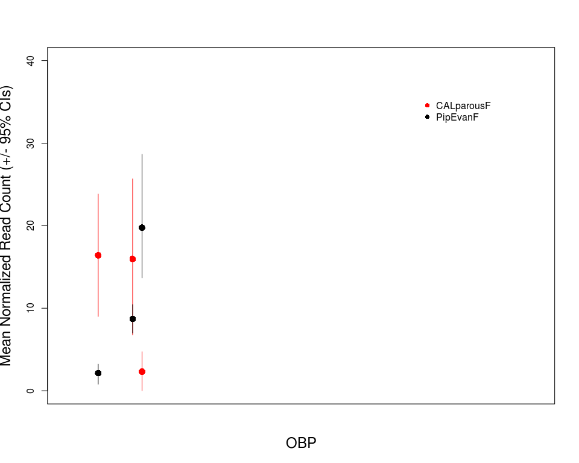
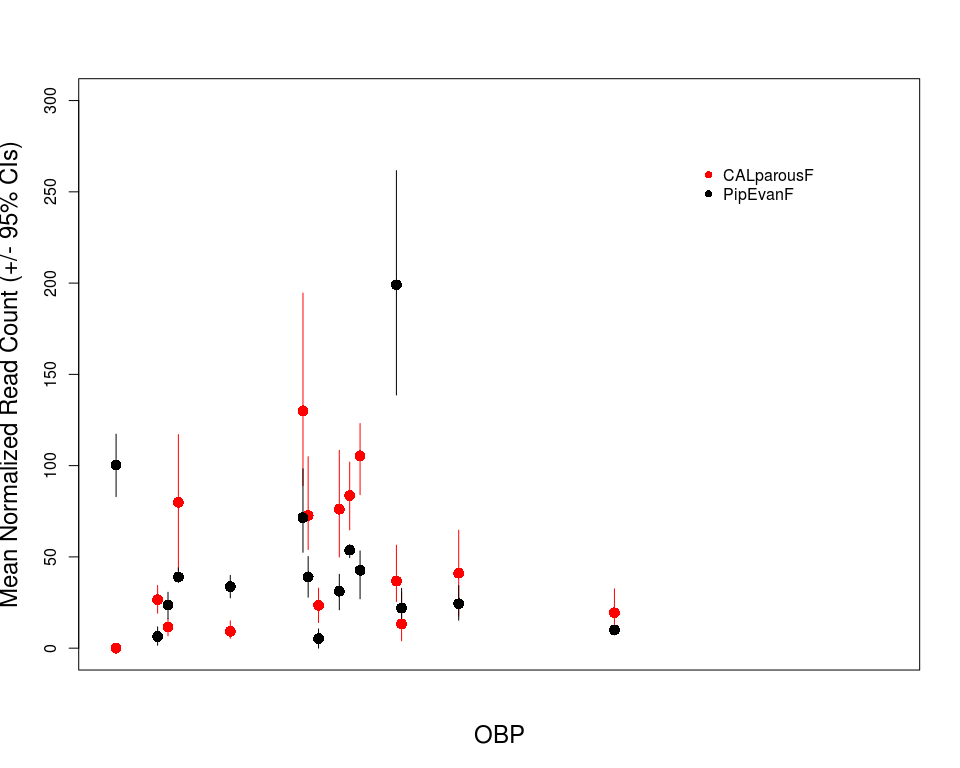

Culex\_Chemosensory\_EDA\_03052018
================
Megan Fritz
March 5, 2018

#### Background

##### The goal of this work was to examine the divergence in levels of chemosensory gene expression in the heads of above- and below-ground Culex pipiens mosquitoes. These mosquitoes tend to have differing host preferences (see Fritz et. al 2015), where above-ground mosquitoes are more aviphilic and below-ground mosquitoes tend toward mammalophilicity. My primary question was which OBPs, ORs, and IRs, if any, show differences in expression levels and thereby may be likely to be involved in host preference.

#### Analytical Methods

##### Loading in data sets and libraries.

``` r
library(sciplot)

#use this to specify the path to your data file
genes_detected <- read.table("~/Desktop/CulexRNAseq/data/all_genes_nocutoff_norm_counts.txt", header = T)
Leal_OBPs <- read.csv("~/Desktop/CulexRNAseq/data/Leal2011_QuinqOBPs_sd01.csv", header = T)
Leal_ORs <- read.csv("~/Desktop/CulexRNAseq/data/Leal2011_QuinqORs_sd04.csv", header = T)
Leal_IRs <- read.csv("~/Desktop/CulexRNAseq/data/Leal2011_QuinqIRs_sd03.csv", header = T)

#just pulling out relevant columns from Leal_OBPs
sub_Leal_OBPs <- Leal_OBPs[,c(1:3)]
sub_Leal_ORs <- Leal_ORs[,c(1:3)]
sub_Leal_IRs <- Leal_IRs[,c(1:2)]

merged_Fritz_OBP_dataset <- merge(genes_detected, sub_Leal_OBPs, by.x = "ID", by.y = "VectorBase_ID")
merged_Fritz_OR_dataset <- merge(genes_detected, sub_Leal_ORs, by.x = "ID", by.y = "New_VB_ID")
merged_Fritz_IR_dataset <- merge(genes_detected, sub_Leal_IRs, by.x = "ID", by.y = "VectorBase_ID")
```

##### Because some OBPs are more widely expressed than others, I first wanted to understand how many were detected in my dataset. I did that but summing the number of reads that aligned to each OBP across all treatment groups.

``` r
merged_Fritz_OBP_dataset$sumCounts <- rowSums(merged_Fritz_OBP_dataset[,c(2:17)])
head(merged_Fritz_OBP_dataset$sumCounts)#checking that rowSums worked
```

    ## [1]  7429 20298 50688  2180  1399  9299

``` r
#getting numbers of OBPs according to overall number of reads aligned
NROW(subset(merged_Fritz_OBP_dataset, sumCounts>=1))
```

    ## [1] 42

``` r
NROW(subset(merged_Fritz_OBP_dataset, sumCounts>=10))
```

    ## [1] 38

``` r
NROW(subset(merged_Fritz_OBP_dataset, sumCounts>=100))
```

    ## [1] 30

``` r
NROW(subset(merged_Fritz_OBP_dataset, sumCounts>=1000))
```

    ## [1] 21

##### I pulled out lowly expressed, moderately expressed, and highly expressed genes and placed them in different dataframes for plotting expression level by mosquito strain.

``` r
sub_OBP_low <- subset(merged_Fritz_OBP_dataset, sumCounts < 100)

sub_OBP_mod <- subset(merged_Fritz_OBP_dataset, sumCounts >=100 & sumCounts < 1000)

sub_OBP_hi <- subset(merged_Fritz_OBP_dataset, sumCounts >=1000)
```

##### I reshaped each dataframe from wide to long format, which was more conducive to plotting.

``` r
#low
sample_names <- names(sub_OBP_low[2:17])
sub_OBP_low_reshaped <- reshape(sub_OBP_low, 
                         varying = list(2:17),
                         direction="long",
                         idvar= "ID",
                         times=sample_names,
                         v.names="Norm_Read_Count",
                         new.row.names=NULL)

names(sub_OBP_low_reshaped)[names(sub_OBP_low_reshaped) == 'time'] <- 'Strain'
sub_OBP_low_reshaped$Rep <- sub_OBP_low_reshaped$Strain
sub_OBP_low_reshaped$Strain = substr(sub_OBP_low_reshaped$Strain,1,nchar(sub_OBP_low_reshaped$Strain)-1)
sub_OBP_low_reshaped$Rep = substr(sub_OBP_low_reshaped$Rep,nchar(sub_OBP_low_reshaped$Rep),nchar(sub_OBP_low_reshaped$Rep))

#sanity check for reformatting
sub_OBP_low_reshaped_CPIJ007931 <- subset(sub_OBP_low_reshaped, ID == "CPIJ007931")
sum(sub_OBP_low_reshaped_CPIJ007931$Norm_Read_Count)
```

    ## [1] 44

``` r
sub_OBP_low_reshaped_CPIJ007931$sumCounts #good news
```

    ##  [1] 44 44 44 44 44 44 44 44 44 44 44 44 44 44 44 44

``` r
#mod
sample_names <- names(sub_OBP_mod[2:17])
sub_OBP_mod_reshaped <- reshape(sub_OBP_mod, 
                         varying = list(2:17),
                         direction="long",
                         idvar= "ID",
                         times=sample_names,
                         v.names="Norm_Read_Count",
                         new.row.names=NULL)

names(sub_OBP_mod_reshaped)[names(sub_OBP_mod_reshaped) == 'time'] <- 'Strain'
sub_OBP_mod_reshaped$Rep <- sub_OBP_mod_reshaped$Strain
sub_OBP_mod_reshaped$Strain = substr(sub_OBP_mod_reshaped$Strain,1,nchar(sub_OBP_mod_reshaped$Strain)-1)
sub_OBP_mod_reshaped$Rep = substr(sub_OBP_mod_reshaped$Rep,nchar(sub_OBP_mod_reshaped$Rep),nchar(sub_OBP_mod_reshaped$Rep))

#sanity check - reformatting
sub_OBP_mod_reshaped_CPIJ013976 <- subset(sub_OBP_mod_reshaped, ID == "CPIJ013976")
sum(sub_OBP_mod_reshaped_CPIJ013976$Norm_Read_Count)
```

    ## [1] 363

``` r
sub_OBP_mod_reshaped_CPIJ013976$sumCounts #good news
```

    ##  [1] 363 363 363 363 363 363 363 363 363 363 363 363 363 363 363 363

``` r
#hi
sample_names <- names(sub_OBP_hi[2:17])
sub_OBP_hi_reshaped <- reshape(sub_OBP_hi, 
                         varying = list(2:17),
                         direction="long",
                         idvar= "ID",
                         times=sample_names,
                         v.names="Norm_Read_Count",
                         new.row.names=NULL)

names(sub_OBP_hi_reshaped)[names(sub_OBP_hi_reshaped) == 'time'] <- 'Strain'
sub_OBP_hi_reshaped$Rep <- sub_OBP_hi_reshaped$Strain
sub_OBP_hi_reshaped$Strain = substr(sub_OBP_hi_reshaped$Strain,1,nchar(sub_OBP_hi_reshaped$Strain)-1)
sub_OBP_hi_reshaped$Rep = substr(sub_OBP_hi_reshaped$Rep,nchar(sub_OBP_hi_reshaped$Rep),nchar(sub_OBP_hi_reshaped$Rep))
```

##### This is my bootstrapping function to generate my 95% confidence intervals for my figures.

``` r
boot.fn <- function(x, N=5000) {
  Int.1 <- replicate(N, mean(sample(x, size= length(x), replace=T)))
  Int.CI <- quantile(Int.1, probs=c(0.025,0.975))
  Int.CI
}
```

#### Results

##### Finally, I used sciplot to view interactions between OBP expression and mosquito treatment group.

``` r
#low
lineplot.CI(CquiOBP, Norm_Read_Count, group = Strain, data = sub_OBP_low_reshaped, type = "p", cex = 1.5,
            xlab = "OBP", ylab = "Mean Normalized Read Count (+/- 95% CIs)", ylim =
            c(0,20), cex.lab = 1.5, col = c("blue", "red", "black", "grey"), 
            pch = c(16,16,16,16), xaxt='n', ci.fun= boot.fn)
```



``` r
#med
lineplot.CI(CquiOBP, Norm_Read_Count, group = Strain, data = sub_OBP_mod_reshaped, type = "p", cex = 1.5,
            xlab = "OBP",   ylab = "Mean Normalized Read Count (+/- 95% CIs)", ylim = c(0,200), 
            cex.lab =1.5, col = c("blue", "red", "black", "grey"), 
            pch = c(16,16,16,16), xaxt='n', ci.fun= boot.fn)
```



``` r
#high
lineplot.CI(CquiOBP, Norm_Read_Count, group = Strain, data = sub_OBP_hi_reshaped, type = "p", cex = 1.5,
            xlab = "OBP", ylab = "Mean Normalized Read Count (+/- 95% CIs)", ylim = c(0,6200), 
            cex.lab =1.5, col = c("blue", "red", "black", "grey"), 
            pch = c(16,16,16,16), xaxt='n', ci.fun= boot.fn)
```


